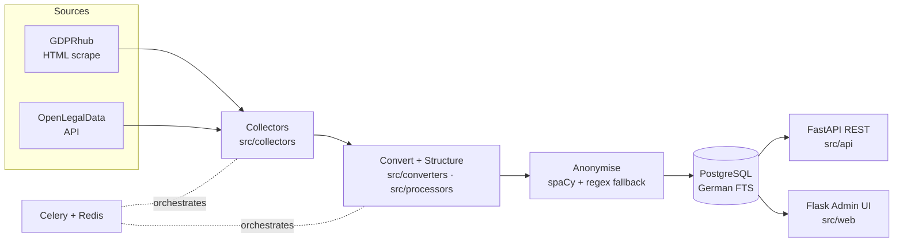

# Datenschutz-Rechtsprechung API


A crawler and search backend for **data-protection court decisions in the DACH region** (Germany, Austria, Switzerland) — *Datenschutz-Rechtsprechung* covers GDPR/DSGVO, BDSG (Germany), DSG/FADP (Switzerland/Austria) and general data-protection rulings. It collects decisions from public legal databases, converts and structures them, anonymises personal data while preserving legal terminology, and exposes the corpus through a PostgreSQL full-text search API.

> Compliance documentation under [`docs/compliance/`](docs/compliance/) is intentionally kept in German because it tracks DACH statutes verbatim.

## The Problem

Data-protection case law in the DACH region is scattered across separate public databases — GDPRhub (a community wiki), OpenLegalData (a German open-data API), and the Austrian RIS. Each has its own format, no shared schema, and no full-text search across all of them. Anyone researching how courts actually apply Art. 82 GDPR or §60d UrhG ends up scraping three sites by hand and re-anonymising PDFs every time.

This project ingests those sources once, normalises them into a single PostgreSQL schema with a German-language full-text index, runs a two-stage anonymisation pass that keeps legal terms intact, and serves the result over a REST API plus an admin UI.

## Features

- **Multi-source collection** — `src/collectors/`: GDPRhub (HTML scraping) and OpenLegalData (API) are implemented; RIS Austria is in the documented scope (`docs/compliance/scope.md`) but not yet a standalone collector.
- **Rate-limited collection** — a `RateLimiter` in `src/collectors/base.py` throttles requests. (robots.txt handling is part of the compliance *design* in [`docs/compliance/GDPR_COMPLIANCE.md`](docs/compliance/GDPR_COMPLIANCE.md) but is **not yet implemented in code** — see [Known Issues](#known-issues).)
- **PDF → text conversion** and German legal-document structure analysis (`src/converters/`, `src/processors/`).
- **Two-stage anonymisation** — spaCy NER (primary) with a regex fallback (`SimpleGermanLegalAnonymizer`); preserves legal terminology, encrypts the anonymisation mapping. See [`docs/compliance/ANONYMIZATION_BACKENDS.md`](docs/compliance/ANONYMIZATION_BACKENDS.md).
- **PostgreSQL full-text search** with a German stemmer and structured filters (`src/filters/`).
- **REST API** — FastAPI, ~28 endpoints (`src/api/`).
- **Admin web UI** — Flask 3 + flask-login (bcrypt, CSRF via flask-wtf), `src/web/`.
- **Async task pipeline (scaffolding)** — Celery + Redis wiring for collection/processing jobs (`src/tasks/`); not yet runnable, see [Known Issues](#known-issues).
- **Containerised** — `docker-compose.yml` for local development; `docker-compose.production.yml` uses `${ENV}` interpolation (no secrets in the file).

## Architecture



## Quickstart

Fastest verifiable path — needs only Python 3.10–3.12, no external services.
`pytest` runs a **curated unit subset** (in-memory SQLite) that is green on a
fresh checkout; integration tests and a set of older drifted tests are
excluded transparently — see [`tests/README.md`](tests/README.md). Coverage
is reported but not asserted.

```bash
git clone https://github.com/fidpa/datenschutz-rechtsprechung-api.git
cd datenschutz-rechtsprechung-api
pip install -r requirements.txt
python -m spacy download de_core_news_sm   # optional (regex fallback works without it)

python examples/walking_skeleton.py        # offline pipeline smoke test
pytest -v --cov=src                         # curated unit suite
```

The full stack (API, admin UI, Celery) needs Docker — see below.

Containerised run (Postgres + Redis + API + worker):

```bash
cp .env.example .env            # edit values; never commit .env
docker compose up -d            # see Known Issues before running
# API:        http://localhost:8000
# Admin UI:   http://localhost:5001/admin/dashboard
```

Full setup and configuration: [`docs/quickstart/`](docs/quickstart/). Database schema: [`docs/architecture/database.md`](docs/architecture/database.md).

> **Security on first run:** the seeded admin login (`admin@admin.com` / `admin`, see `docs/quickstart/QUICK_START.md`) is for local bootstrap only — change it immediately and never expose a default-credentialed instance. The passwords in `docker-compose.yml` / `docker-compose.test.yml` are local-development defaults; production reads all secrets from the environment via `docker-compose.production.yml`.

## Tech Stack

| Layer | Technology |
|-------|------------|
| API | FastAPI 0.104, Pydantic 2.5, uvicorn |
| Web UI | Flask 3, flask-login, flask-wtf |
| Persistence | PostgreSQL via SQLAlchemy 2.0 (async, asyncpg), Alembic |
| Tasks | Celery 5.3 + Redis |
| NLP | spaCy 3.7 (German model) |
| HTTP | httpx |
| Runtime | Python 3.11 (Docker `python:3.11-slim`) |

## Compliance Note

The crawler is designed to operate under the **text-and-data-mining exception of §60d UrhG** (German Copyright Act) and only processes **publicly available** court decisions. It applies rate limiting (implemented) and anonymises personal data before storage and before any API exposure. `robots.txt` compliance is part of the documented design but **not yet implemented in code** (see [Known Issues](#known-issues)). The legal reasoning is documented (in German) in [`docs/compliance/GDPR_COMPLIANCE.md`](docs/compliance/GDPR_COMPLIANCE.md) and [`docs/compliance/scope.md`](docs/compliance/scope.md). This is the project's own compliance design and **not legal advice** — verify applicability for your jurisdiction and use case before operating a crawler.

## Known Issues

- **robots.txt is not enforced in code.** Rate limiting is implemented
  (`src/collectors/base.py`); robots.txt handling exists only as design in
  `docs/compliance/`. Do not rely on automatic robots.txt compliance yet.
- **The Celery task pipeline (`src/tasks/`) is scaffolding, not yet runnable.**
  `src/tasks/crawler_tasks.py` instantiates its task objects at import time,
  so `celery -A src.tasks worker` does not start cleanly. The collectors,
  processors and FTS layer it would orchestrate do work and are exercised by
  the unit suite and `examples/walking_skeleton.py`.
- **`docker compose up -d` is spot-checked, not end-to-end validated.** The
  dev compose starts `postgres` + `redis` (the documented local-dev path);
  the full `production` profile builds `docker/Dockerfile` but has not been
  run end-to-end on a fresh host. The pytest path (above) is the verifiable
  Quickstart.

## Project Status

Alpha. Single-developer project, made public as an engineering showcase.

- A reference import in **August 2025** is documented at roughly **1,200+ decisions** (GDPRhub + OpenLegalData). This figure originates from internal project notes and was **not re-measured** for this public release — treat it as a historical snapshot, not a guarantee.
- Test coverage figures in older internal notes are inconsistent (stated variously as >80 %, ~85 %, 93 %) and are therefore **not asserted here**; run `pytest --cov=src` to measure your checkout.

## License

[MIT](LICENSE) © 2026 Marc Allgeier

## Contributing & Security

See [CONTRIBUTING.md](CONTRIBUTING.md) and [SECURITY.md](SECURITY.md). Please report vulnerabilities privately via a GitHub Security Advisory rather than a public issue.
